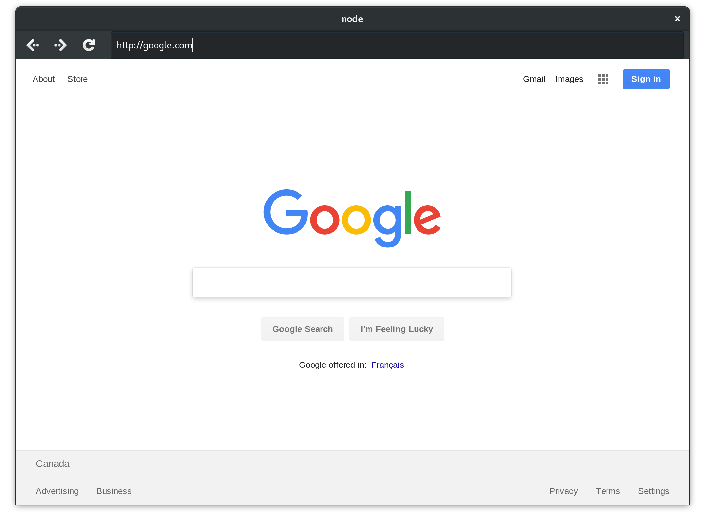
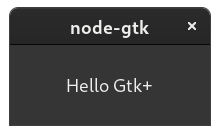

# node-gtk

#### GNOME Gtk+ bindings for NodeJS


### What is this ?
A work in progress to bring Gtk+ usable directly from NodeJS so that the environment would be more updated and supported than the one available via [GJS](https://wiki.gnome.org/action/show/Projects/Gjs).
It uses the GObject Introspection library (as [PyGObject](https://pygobject.readthedocs.io), for example), so any gobject-introspectable library is supported.

Please note this project is currently in a _beta_ state and is being developed. Any contributors willing to help
will be welcomed.

Supported Node.js versions: **8**, **9**, **10**, **11**, **12**  
Pre-built binaries available for: **Linux**, **OS X**

### How do I use it?

You can use Gtk+ API directly, or you can use [react-gtk](https://github.com/codejamninja/react-gtk) to develop a `node-gtk` application using React.


[Browser demo source](https://github.com/romgrk/node-gtk/blob/master/examples/browser.js)

### Table of contents

- [Example](#example)
- [Documentation](#documentation)
  * [Exports](#exports)
  * [Signals (event handlers)](#signals-event-handlers)
  * [Gtk](#gtk)
  * [Naming conventions](#naming-conventions)
- [Installing and building](#installing-and-building)
  * [Target Platforms (so far)](#target-platforms-so-far)
  * [Requirements](#requirements)
  * [How to build on Ubuntu](#how-to-build-on-ubuntu)
  * [How to build on ArchLinux](#how-to-build-on-archlinux)
  * [How to build on OSX](#how-to-build-on-osx)
  * [Experimental platforms](#experimental-platforms)
  * [Testing the project](#testing-the-project)
    + [Browser demo](#browser-demo)
- [Features that supported](#features-that-supported)
- [Support](#support)


## Example

```javascript
const gi = require('node-gtk')
Gtk = gi.require('Gtk', '3.0')

gi.startLoop()
Gtk.init()

const win = new Gtk.Window();
win.on('destroy', () => Gtk.mainQuit())
win.on('delete-event', () => false)

win.setDefaultSize(200, 80)
win.add(new Gtk.Label({ label: 'Hello Gtk+' }))

win.showAll();
Gtk.main();
```




## Documentation

### Exports

<dl>
<dt><a href="#require">require(ns, [version])</a> ⇒ <code>Object</code></dt>
<dd><p>Requires a module. Automatically loads dependencies.</p></dd>
<dt><a href="#prependSearchPath">prependSearchPath(path)</a></dt>
<dd><p>Prepends a path to GObject-Introspection search path (for typelibs)</p>
</dd>
<dt><a href="#prependLibraryPath">prependLibraryPath(path)</a></dt>
<dd><p>Prepends a path to GObject-Introspection library path (for shared libraries)</p>
</dd>
</dl>

#### require(ns, [version]) ⇒ <code>Object</code>
Requires a module. Automatically loads dependencies.

**Returns**: <code>Object</code> - the loaded module  

| Param | Type | Default | Description |
| --- | --- | --- | --- |
| ns | <code>string</code> |  | namespace to load |
| version | <code>string</code> | <code>null</code> | version to load (null for latest) |

<a name="prependSearchPath"></a>

#### prependSearchPath(path)
Prepends a path to GObject-Introspection search path (for typelibs)

| Param | Type |
| --- | --- |
| path | <code>string</code> | 

<a name="prependLibraryPath"></a>

#### prependLibraryPath(path)
Prepends a path to GObject-Introspection library path (for shared libraries)

| Param | Type |
| --- | --- |
| path | <code>string</code> | 


### Signals (event handlers)

Signals (or events, in NodeJS semantics) are dispatched through the usual `.on`,
`.off`, and `.once` methods.

Returning `true` from an event handler can have the special semantic of stopping the event
from being propagated or preventing the default behavior. Refer to GTK documentation for details.
(E.g. [GtkWidget signals](https://developer.gnome.org/gtk3/stable/GtkWidget.html#GtkWidget.signals))

```javascript
const input = new Gtk.Entry()

/**
 * GObject.on - associates a callback to an event
 * @param {String} name - Name of the event
 * @param {Function} callback - Event handler
 */
input.on('key-press-event', onKeyPress)

/**
 * GObject.off - dissociates callback from an event
 * @param {String} name - Name of the event
 * @param {Function} callback - Event handler
 */
input.off('key-press-event', onKeyPress)

/**
 * GObject.once - as GObject.on, but only runs once
 * @param {String} name - Name of the event
 * @param {Function} callback - Event handler
 */
input.once('key-press-event', onKeyPress)


function onKeyPress(event) {
  // event.__proto__ === Gdk.EventKey
  console.log(event.string, event.keyval)
}
```

Low-level methods `.connect(name: String, callback: Function) : Number` and
`.disconnect(name: String, handleID: Number) : void` are also available.

### GTK

For GTK objects and functions documentation, please refer to [gnome documentation](https://developer.gnome.org/gtk3/stable/), or any other GIR generated documentation as [valadoc](https://valadoc.org/gtk+-3.0/index.htm).

### Naming conventions

 - **Functions, Methods & Virtual Functions**: `lowerCamelCase`  
    Methods on GObject, structs, unions and functions on namespaces.  
    Example:  
    `GLib.randomIntRange(0, 100)`  
    `textBuffer.placeCursor(0)`

 - **Fields & Properties**: `lowerCamelCase`  
    Fields are on structs and unions.  
    Properties are on GObjects.  
    Example:  
    `textView.showLineNumbers = true`  
    `new Gdk.Color().blue = 200`

 - **Structs, Unions, GObjects & Interfaces**: `UpperCamelCase`  
    Defined on namespaces.  
    Example:  
    `Gtk.Button`  
    `Gdk.Color`

 - **Enums, Flags**: `UpperCamelCase`  
    Defined on namespaces.  
    Example:  
    `Gtk.AttachOptions`  
    `Gdk.EventType`

 - **Constants & Values**: `SNAKE_CASE` (not modified, may contain lowercase)  
    Can be attached on namespaces or on specific objects.  
    Example:  
    `Gdk.KEY_g !== Gdk.KEY_G`  
    `Gdk.EventType.KEY_PRESS`

 - **Signals**: `dash-case`  
    Events triggered by GObjects.  
    Example:  
    `gtkEntry.on('key-press-event', (ev) => { ... })`


## Installing and building

### Target Platforms (so far)
We're planning to serve pre-built binaries in order to make this project as cross-platform and easy to install
as possible.  However, right now we support only **Linux** and experimentally **OSX** but in both targets,
_the project will fallback to build_.


### Requirements
In order to clone, install, and build this project you'll need a working copy of git, nodejs 8 or higher, npm,
python2, and either gcc 8 (other versions may fail) or clang.
In the _not-working-yet_ Windows platform, all dependencies must be available under [MSYS2 shell](https://msys2.github.io).


### How to build on Ubuntu

Be sure `node` is version **8** or higher.
Ignore the following step iv `node --version` is already 8 or higher.

```sh
# setup node 10
curl -sL https://deb.nodesource.com/setup_10.x | sudo -E bash -
```

Install basic dependencies.

```sh
# install dependencies
sudo apt-get install \
  build-essential git \
  nodejs \
  gobject-introspection \
  libgirepository1.0-dev
```

At this point `npm install node-gtk` should already install, fallback and build `node-gtk` without problems.

### How to build on Fedora

Install basic dependencies:

```sh
sudo dnf install \
  @development-tools \
  nodejs \
  gobject-introspection \
  gtk3
```

After installing of packages, run `npm install node-gtk`.

### How to build on ArchLinux

The following should be the bare minimum to be able to build the project.

```sh
pacman -S --needed \
  base-devel git \
  nodejs npm \
  gtk3 gobject-introspection
```

Feel free to install all `base-devel` utilities.

After installing those packages, `npm install node-gtk` would do.


### How to build on OSX
Assuming you have [brew](http://brew.sh) installed, the following has been successfully tested on El Captain.

```sh
# basic dependencies to build this repo
brew install git node gobject-introspection gtk+3
```

At this point `npm install node-gtk` should already install, fallback and build `node-gtk` without problems.


### Testing the project

If you'd like to test everything builds and work properly, find a target to clone this project, then run `npm install`.

```sh
# clone and build
git clone https://github.com/romgrk/node-gtk.git
cd node-gtk
npm install

# how to verify from node-gtk folder
./examples/hello-gtk.js
```
If you'll see a little window saying hello that's it: it works!

Please note in OSX the window doesn't automatically open above other windows.
Try <kbd>Cmd</kbd> + <kbd>Tab</kbd> if you don't see it.


#### Browser demo

If you'd like to test `./examples/browser.js` you'll need [WebKit2 GTK+](http://webkitgtk.org/) libary.

  * in **Ubuntu**, you can `apt-get install libwebkit2gtk-3.0` (`4.0`   works too) and try it out.
  * in **Fedora**, you should run `sudo dnf install webkit2gtk3`
  * in **ArchLinux**, you can `pacman -S --needed webkitgtk` and try it out.
  * in **OSX**, there is no way to run it right now because `webkitgtk` was removed from homebrew

Once installed, you can `./examples/browser.js google.com` or any other page, and you might try the _dark theme_ out too:

```sh
# OSX needs to have the Adwaita theme installed
# brew install adwaita-icon-theme

# Usage: ./examples/browser.js <url> [theme]
./examples/browser.js  google.com  dark
```


### Experimental platforms

Following how to setup the configuration to at least try building this project.


#### How to build on Windows (experimental)
Mandatory dependency is _[Visual Studio Community](https://www.visualstudio.com/en-us/products/visual-studio-community-vs.aspx)_ or _Express_ with a C++ compiler (open a new C++ project and install it via IDE if necessary).

The easiest/tested way to at least try building this repository is within a _MinGW shell_ provided by the [MSYS2 installer](https://msys2.github.io/).

Once VS and its C++ compiler is available and MSYS2 installed, launch the MinGW shell.

```sh
# update the system
# in case of errors, wait for the update to complete
# then close and open again MingW shell
pacman -Syyu --noconfirm

# install git, gtk3 and extra dependencie
pacman -S --needed --noconfirm git mingw-w64-$(uname -m)-{gtk3,gobject-introspection,pkg-config}

# where to put the repository clone?
# pick your flder or use ~/oss (Open Source Software)
mkdir -p ~/oss/
cd ~/oss

# clone node-gtk there
git clone https://github.com/romgrk/node-gtk
cd node-gtk

# first run might take a while
GYP_MSVS_VERSION=2015 npm install
```
The `GYP_MSVS_VERSION` could be 2010, 2012, 2013 or 2015.
Please verify [which version you should use](https://github.com/nodejs/node-gyp#installation)


#### Possible issue on MinGW shell
In case you are launching the general executable without knowing the correct platform,
the binary path might not be available.

In such case `python` won't be available either, and you can check via `which python` command.

If not found, you need to export the platform related binary path:

```sh
# example for the 32bit version
export PATH="/mingw32/bin:$PATH"
npm run install
```

This should do the trick. You can also check if there is any python at all via `pacman -Qs python`.

Please remember `python2` is the one needed.


#### Known issues building on Windows
Right now there are few gotchas and the build will most likely fail. Please help with a PR if you know how to solve the issue, thank you!


## Features That Supported

There are still less used features that are not supported, but everything you should need to start building
a working Gtk application is supported.

 - [x] primitive data types (int, char, …)
 - [x] complex data types (arrays, GArray, GList, GHashTable, …)
 - [x] GObjects
 - [x] Interfaces: methods on GObjects
 - [ ] Interfaces: raw C struct conversion to JS
 - [x] Signals (`.connect('signal', cb)` or `.on('signal', cb)`)
 - [x] Boxed (struct and union) (opaque, with `new`)
 - [x] Boxed (struct and union) (opaque, without `new`)
 - [x] Boxed (struct and union) (allocation with size)
 - [x] Error handling
 - [x] Callback arguments
 - [x] Function call: IN, OUT & INOUT arguments
 - [x] Properties (on GObjects)
 - [x] Fields (on Boxeds)
 - [x] Event loop (main)
 - [ ] Additional event loops (e.g. `g_timeout_add_seconds`)
 - [ ] GParamSpec
 - [ ] Javascript inheritance of C classes
 - [x] Memory management
 
 ## Support
 If you are interested in this project or need help with this project, don't hesitate to join our [Discord channel](https://discord.gg/r2VqPUV).
